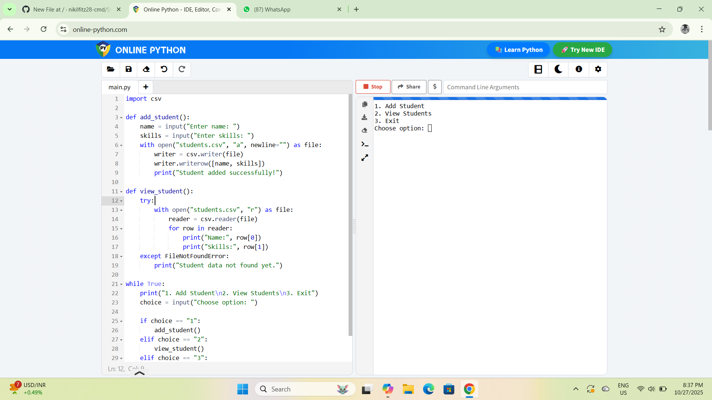

# Student Skill Tracker

This Python project helps manage student names and skills using CSV file handling. It runs in the terminal and allows users to add student data and view records.

# Features
- Add student name and skills
- View all student records
- Save data in CSV file
- Simple menu-driven interface

# How to Run
1. Save the code as `student.py`
2. Run in IDLE or online compiler
3. Choose option from menu

# Sample Output

# Technologies Used
- Python
- CSV module

# Developed By
Nikil S, B.Sc Computer Science (AI & Data Science)  
Dr. Rajalakshmi College of Arts and Science, Coimbatore
